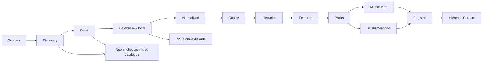

# Vue d'ensemble de l'architecture

> Synthèse de [RFC-002](../rfc/RFC-002-architecture-globale.md), au statut `DRAFT`.

Cerebro est le nœud de données : collecte, replay, traitements, DuckDB, packs et opérations sous `ATLAS_DATA_DIR`. Neon catalogue checkpoints, états de run, index et manifestes sans stocker l'historique massif ; R2 archive les publications validées et permet la restauration. Le raw n'est jamais modifié ; les couches dérivées sont liées par manifestes, versions et hashes. Batch et micro-batch sont privilégiés avant toute infrastructure de streaming complexe.
