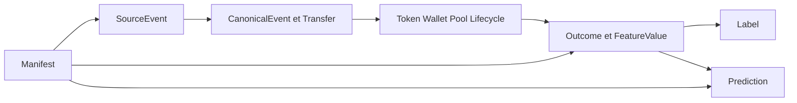

# Modèle canonique des données

> Synthèse de [RFC-003](../rfc/RFC-003-modele-canonique-des-donnees.md), au statut `DRAFT`.

AtlasPump sépare six couches : raw immuable, événements normalisés, entités curated, dérivés/features, labels et prédictions. Le contrat d'échange central est `CanonicalEvent`; chaque événement conserve une provenance vers un ou plusieurs `SourceEvent`.

Règles clés : UTC explicite, `NULL` sans valeur sentinelle, montants exacts en unités minimales ou decimal, `block` préservé comme champ source, censure explicite, schéma semver et manifests pour toute publication.
