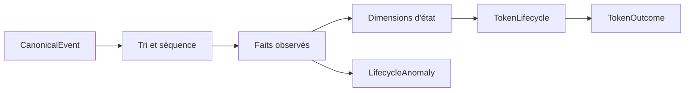

# Token Lifecycle

> Synthèse de [RFC-006](../rfc/RFC-006-token-lifecycle-engine.md), au statut `DRAFT`.

Un lifecycle est une reconstruction versionnée des faits observés pour un mint, dans une fenêtre donnée. Il ne décrit pas nécessairement la vie complète du token et distingue toujours faits, inférences, qualité, censure et complétude.

Les dimensions sont : `activity_state`, `migration_state`, `censoring_status`, `coverage_status`, `contract_status` et `usability_status`. Une migration inférée ne remplace jamais une migration observée ; une absence de couverture produit de la censure, pas une conclusion économique.
