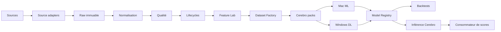
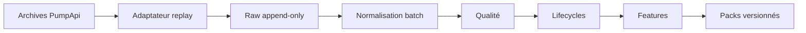
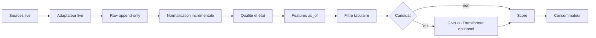

# RFC-002 — Architecture globale d'AtlasPump

| Champ | Valeur |
| --- | --- |
| Numéro | RFC-002 |
| Titre | Architecture globale d'AtlasPump |
| Statut | DRAFT |
| Auteur | Équipe AtlasPump |
| Date | 2026-07-16 |
| Version | 0.1 |

## Résumé

AtlasPump adopte une architecture modulaire centrée sur des couches de données rejouables. Cerebro est le nœud de données et d'exploitation ; Mac et Windows consomment des packs versionnés pour l'entraînement. Cette RFC propose contrats, flux et mécanismes communs sans imposer de framework.

## Contexte

RFC-001 fait des données l'actif principal. Des expérimentations externes ont validé replay PumpApi, normalisation streaming, Parquet, déduplication, lifecycles et censure à grande échelle. Elles sont des preuves de faisabilité, non des contraintes d'implémentation. Cette RFC cadre les RFC-003 à RFC-013.

## Objectifs

- Séparer raw, normalisé, curated, features, datasets, modèles et décisions.
- Rendre chaque étape idempotente, incrémentale, observable et rejouable.
- Isoler les fournisseurs et rendre les packs portables entre machines.
- Faire des packs versionnés la frontière entre données et entraînement.
- Privilégier batch et micro-batch avant streaming distribué complexe.

## Non-objectifs

- Définir les schémas canoniques, la rétention détaillée ou les formules de features.
- Imposer Kafka, Redis, RDS, un registre externe ou un service managé.
- Autoriser une exécution réelle ou centraliser les entraînements sur Cerebro.

## Principes

1. Raw immuable ; couches dérivées séparées ; faits et inférences distincts.
2. Composants remplaçables derrière des contrats documentés et adaptateurs fournisseurs isolés.
3. Écritures idempotentes, reprise par checkpoints, traitement incrémental et rejeu complet.
4. Schémas, politiques, datasets et modèles versionnés par manifestes liés.
5. Aucun chemin absolu : `ATLAS_DATA_DIR` configure les emplacements.
6. Données volumineuses hors Git ; batch d'abord ; simplicité et observabilité par défaut.

## Architecture globale

## Composants et contrats

| Composant | Entrées | Sorties | Responsabilité |
| --- | --- | --- | --- |
| Source Adapter Layer | API, WebSocket, archives | enveloppes source | Isoler PumpApi, PumpPortal et futurs fournisseurs ; gérer live/replay, retries, erreurs, checkpoints et provenance. |
| Raw Ingestion Layer | enveloppes | captures raw + manifeste | Écrire append-only le payload immuable, métadonnées d'ingestion, hash et détection de perte silencieuse. |
| Normalization Layer | raw | événements canoniques + rejets | Parser/classifier, gérer unités/précision, référencer raw, publier `UNKNOWN` et versionner la logique. |
| Quality Layer | événements canoniques | VALID/PARTIAL/INVALID + rapport | Mesurer couverture, trous, doublons, anomalies et confiance sans confondre manque de données et échec économique. |
| Lifecycle Layer | événements qualifiés | lifecycles et états | Grouper par token, ordonner et représenter création, bonding curve, migration, PumpSwap, liquidité et censure. |
| Feature Lab | curated/lifecycles | feature sets | Produire features versionnées, `as_of`, horizons et qualité sans fuite temporelle. |
| Dataset Factory | features, labels, cohortes | packs + manifestes | Produire splits et formats portables ML, survie, graphes, séries, sorties et backtests. |
| Training Layer | packs | artefacts, expériences | Entraîner, comparer aux baselines et publier configuration/environnement. |
| Model Registry | artefacts + lineage | modèles qualifiés | Lier modèle, dataset, features, labels, code, métriques et statut. |
| Backtesting Layer | scores, données, règles | simulation + rapport | Interdire l'anticipation et modéliser frais, latence, liquidité et slippage. |
| Inference Layer | live + modèles validés | scores + métadonnées | État incrémental, scoring, règles de sécurité ; aucun ordre réel initialement. |
| Operations Layer | tous composants | logs, métriques, alertes | Exécution 24/7, health checks, rotation, disque, sauvegarde et reprise. |

### Règles des couches

Les adaptateurs émettent payload original, fournisseur, mode, réception, checkpoint, version et provenance. Le raw privilégié est JSONL.ZST, partitionné conceptuellement par fournisseur/mode/fenêtre. Écritures temporaires, finalisation atomique, hashes, journal de reprise et manifests protègent des fichiers partiels.

La normalisation produit Parquet analytique et ne supprime ni rejet ni `UNKNOWN`. Quality conserve statut, confiance et raisons. Lifecycle distingue migrations observées et inférées, ainsi que censure gauche/droite. Feature Lab couvre temporel, volume, prix, bonding curve, wallets, créateurs, concentration, entropie, graphe, liquidité et survie ; les formules restent hors RFC-002.

## Flux

### Historique

Chaque fenêtre est checkpointée et idempotente. Une sortie n'est publiée qu'avec un manifeste valide ; sinon elle reste reprenable ou signalée.

### Live et inférence

Le live commence en micro-batch ou boucle checkpointée. Les contrats sont communs avec batch, avec fraîcheur et état en plus.

### Entraînement et retour modèle

`Packs Cerebro -> transfert explicite avec manifeste et hash -> Mac/Windows -> entraînement -> artefact et résultats -> registre -> validation/benchmark -> export versionné vers Cerebro -> activation contrôlée.`

Le récepteur vérifie hashes, versions et compatibilité. Le protocole de copie reste ouvert ; un transfert ne vaut pas publication.

## Frontières

| Frontière | Règle |
| --- | --- |
| Raw → normalized | Raw inchangé ; normalisation versionnée, rejets et `UNKNOWN` explicites. |
| Normalized → curated | Qualité et complétude sont des attributs, jamais des suppressions silencieuses. |
| Curated → features | Provenance, `as_of`, version et contrôle de fuite obligatoires. |
| Features → datasets | Cohortes, labels, splits et manifestes deviennent immuables. |
| Datasets → modèles | Un modèle lit uniquement un pack publié. |
| Batch → live | Contrats communs ; live ajoute état, fraîcheur et reprise. |
| Cerebro → Mac/Windows | Seuls packs et artefacts versionnés traversent la frontière. |
| Modèle → stratégie → action | Score, règles de décision et ordre sont séparés. |

## Formats et versionnement

| Catégorie | Format privilégié |
| --- | --- |
| Raw | JSONL.ZST |
| Normalized, curated, features | Parquet |
| Vues, audits, traitements locaux | DuckDB |
| Packs | Parquet et formats adaptés aux graphes/séries |
| Échange/lineage | Manifestes JSON et rapports Markdown |
| Déploiement modèle | Natif ou ONNX selon compatibilité |

Chaque manifeste lie entrées, hashes, fenêtres, fournisseur, producteur, configuration, environnement, sorties, schéma et statistiques. Il transporte selon la couche : `schema_version`, `normalization_version`, `quality_policy_version`, `lifecycle_version`, `feature_set_version`, `label_policy_version`, `dataset_version`, `split_version`, `model_version` et `inference_policy_version`. Granularité, format de version et catalogue central restent ouverts.

## Répartition par machine

| Machine | Responsabilités proposées |
| --- | --- |
| Cerebro, stockage dédié sous `/mnt/atlaspump` | Raw, replay/live, normalisation, qualité, DuckDB, lifecycles, Feature Lab, Dataset Factory, packs, opérations et inférence compatible. |
| MacBook Pro M4 Pro | Développement, exploration, Random Forest, XGBoost, CatBoost, survie et SHAP. |
| Windows RTX 3080 | GNN, Transformers, hybrides, autoencodeurs et modèles de sortie. |

`/mnt/atlaspump` est une convention locale, jamais un chemin intégré aux contrats. Mac et Windows ne deviennent pas sources canoniques de données.

## Observabilité, sécurité et robustesse

Métriques minimales : événements reçus, débit, retard d'ingestion, erreurs, doublons, `UNKNOWN`, espace disque, durée/mémoire des étapes, heures manquantes, tokens traités, cycles incomplets, modèles chargés, temps d'inférence et erreurs de scoring. Les logs sont structurés et corrélables par exécution, fenêtre et manifeste.

Secrets hors Git, moindre privilège, validation d'entrée, hashes, écritures atomiques, quarantaine de fichiers partiels, sauvegarde et tests de restauration sont requis. Les environnements recherche, exploitation, paper trading et futur trading réel sont séparés ; ce dernier est hors périmètre.

## Alternatives examinées

| Alternative | Avantages | Inconvénients | Position provisoire |
| --- | --- | --- | --- |
| Monolithe vs composants séparés | Démarrage simple vs contrats remplaçables | Couplage vs coordination | Composants logiques, pas microservices imposés. |
| Kafka/Redis vs fichiers/DuckDB | Latence/découplage vs simplicité/rejeu | Exploitation vs latence | Fichiers + DuckDB au départ. |
| Base centrale vs lake Parquet | Transactions vs portabilité analytique | Administration vs métadonnées | Lake Parquet local ; métadonnées dédiées ouvertes. |
| Tout Cerebro vs séparation | Moins de transfert vs matériel adapté | GPU limité vs transfert | Séparation via packs vérifiés. |
| Streaming pur vs micro-batch | Latence vs reprise/coût simples | Complexité vs délai | Batch puis micro-batch. |
| Vues matérialisées vs DuckDB | Lecture rapide vs moins de duplication | Stockage/fraîcheur vs calcul | Décider selon usage et mesure. |
| Modèle unique vs cascade | Simplicité vs coût réduit | Coût vs orchestration | Cascade à benchmarker. |
| GNN en ligne vs embeddings pré-calculés | Fraîcheur vs latence | Coût vs obsolescence | Benchmark et cache avant décision. |

## Décisions provisoires

1. Architecture modulaire, en composants logiques.
2. Data lake local sur Cerebro ; Parquet comme format analytique principal.
3. DuckDB comme moteur local de référence pour vues, audits et traitements.
4. Batch et micro-batch avant streaming complexe.
5. Packs versionnés comme frontière data/entraînement.
6. Séparation Cerebro/Mac/Windows avec transferts explicites vérifiés.
7. Cascade de modèles proposée pour l'inférence, seulement si benchmarkée.
8. Manifestes obligatoires pour toute publication de couche.
9. Aucune dépendance initiale à Kafka, Redis, RDS ou service managé équivalent.

## Impacts, tests et acceptation

Cette architecture exige jobs reprenables, surveillance stockage/coût et protocoles de transfert robustes. Les RFC d'implémentation devront exiger tests de contrat inter-couches, idempotence, reprise, intégrité manifeste/hash, écritures atomiques, évolution de schéma, absence de fuite temporelle, portabilité des packs et benchmarks d'inférence. Elle pourra être `ACCEPTED` si ces frontières, flux, alternatives, versionnement et responsabilités sont validés comme cohérents avec RFC-001.

## Questions ouvertes

- Faut-il conserver un service live permanent ou utiliser du micro-batch ?
- Faut-il matérialiser les datasets journaliers ?
- Combien de temps conserver raw, normalized et curated ?
- Faut-il une base de métadonnées dédiée ?
- Faut-il introduire un bus de messages plus tard ?
- Comment transférer les packs entre machines avec vérification et coût maîtrisé ?
- Où conserver le registre de modèles ?
- Quelle partie de l'inférence doit tourner sur Cerebro ?
- Les embeddings GNN doivent-ils être pré-calculés ?
- Quelle granularité de versionnement adopter ?
- Quand introduire une infrastructure distribuée ?

## Décision finale

En attente de revue. Cette RFC reste `DRAFT` et n'autorise aucune implémentation de brique structurante.

## Historique des modifications

| Date | Version | Modification | Auteur |
| --- | --- | --- | --- |
| 2026-07-16 | 0.1 | Création du brouillon | Équipe AtlasPump |
