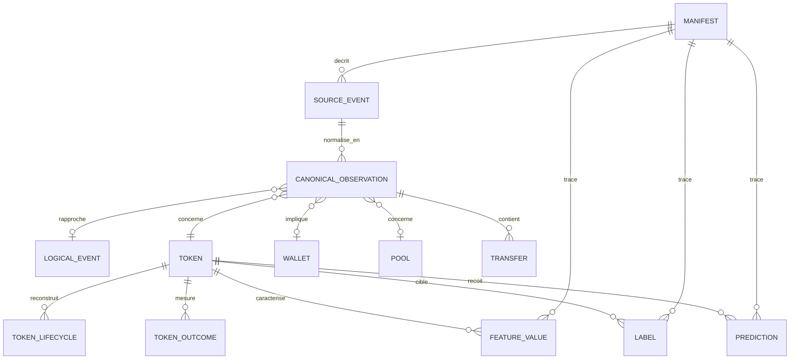

# RFC-003 — Modèle canonique des données

| Champ | Valeur |
| --- | --- |
| Numéro | RFC-003 |
| Titre | Modèle canonique des données |
| Statut | DRAFT |
| Auteur | Équipe AtlasPump |
| Date | 2026-07-16 |
| Version | 0.2 |

## Résumé

Cette RFC définit le langage commun d'AtlasPump : entités, événements, identité, temps, unités, nulls, provenance et couches de données. Elle est indépendante de PumpApi : un fournisseur est adapté vers le modèle, sans introduire ses champs spécifiques dans les entités principales.

## Principes et portée

- Un champ absent ou inconnu reste `NULL`, jamais zéro, chaîne vide ou valeur sentinelle.
- Les faits observés, données dérivées, labels et prédictions sont des couches distinctes.
- Toute donnée possède provenance, version de schéma et référence raw ou manifeste lorsque applicable.
- Les identifiants sont déterministes lorsque les éléments stables sont disponibles.
- Les positions Solana restent distinctes : `slot`, `block_height` et toute valeur fournisseur non mappée.
- Les données censurées sont explicitement représentées et ne valent pas échec.
- Cette RFC ne définit ni algorithme de lifecycle, ni labels métier, ni formules de features.

## Couches de données

| Couche | Peut contenir | Ne doit pas contenir | Provenance/version |
| --- | --- | --- | --- |
| Raw | Payload fournisseur immuable et métadonnées de réception. | Normalisation ou correction métier. | SourceEvent, hash, manifeste, schéma source. |
| Normalized | CanonicalEvent et Transfer normalisés. | Scores, labels, inférences. | Raw, `schema_version`, `normalization_version`. |
| Curated | Entités validées, lifecycles, anomalies, qualité. | Prédictions présentées comme faits. | Inputs normalized, politique qualité/lifecycle. |
| Derived | Agrégats, outcomes et features calculés. | Événement fournisseur prétendument brut. | Dataset source, run et version de calcul. |
| Labelled | Cibles factuelles, composites, survie ou pseudo-labels. | Valeur future connue à `observation_cutoff`. | Politique de label, censure et horizon. |
| Predicted | Scores et décisions de modèle. | Faits historiques ou ordre réel. | Modèle, dataset, features et politique d'inférence. |

## Entités et relations

Un événement source est le message tel que reçu. Une observation canonique est sa normalisation, identifiée par `canonical_observation_id`. Un événement logique est une occurrence blockchain cross-source seulement lorsqu'un rapprochement fiable est démontré ; son identifiant est `logical_event_id`. Sans preuve suffisante, plusieurs observations sont conservées avec une relation de similarité ou de rapprochement, sans fusion silencieuse.

## SourceEvent

| Champ | Type | Null | Sémantique/validation |
| --- | --- | --- | --- |
| `source_event_id` | string | non | Identité stable fournisseur si disponible, sinon identité déterministe locale versionnée. |
| `source`, `source_endpoint`, `source_partition`, `source_offset` | string | source non | Provenance ; endpoint/partition/offset nullable si non fournis. |
| `received_at`, `archive_timestamp` | timestamp UTC | reçu non | Réception locale ; horodatage de l'archive nullable. |
| `source_schema_version` | string | oui | Version annoncée ou inférée du payload. |
| `payload_hash` | string | non | Hash cryptographique du payload exact. |
| `raw_payload` | binary/string | non | Octets ou JSON source immuable. |
| `ingestion_run_id`, `file_manifest_id` | string | non/oui | Run d'ingestion ; manifeste nullable avant finalisation. |

## CanonicalObservation et LogicalEvent

Tous les timestamps sont UTC, sans timezone implicite, en précision microseconde (lecture milliseconde acceptée puis normalisée). Les montants et prix sont décrits dans « Unités ».

| Champ | Type logique | Null | Origine et validation |
| --- | --- | --- | --- |
| `canonical_observation_id` | string | non | Identité déterministe de cette normalisation fournisseur, unique pour `id_strategy_version`. |
| `logical_event_id` | string | oui | Identité cross-source seulement si signature et indices/preuves permettent une correspondance fiable ; sinon `NULL`. |
| `event_type` | enum | non | `BUY`, `SELL`, `TRANSFER`, `CREATE_TOKEN`, `CREATE_POOL`, `MIGRATE`, `ADD_LIQUIDITY`, `REMOVE_LIQUIDITY`, `UNKNOWN`, `INVALID_JSON`. |
| `source` | string | non | Fournisseur d'observation ; pas une preuve d'unicité logique. |
| `signature` | string | oui | Signature de transaction observée ; format Solana validé si présent. |
| `slot` | integer | oui | Slot Solana, uniquement lorsqu'explicitement connu ; aucune conversion implicite. |
| `block_height` | integer | oui | Hauteur de bloc, uniquement lorsqu'explicitement connue ; aucune conversion implicite. |
| `provider_block` | string/integer | oui | Valeur nommée `block` par le fournisseur sans preuve de mapping vers `slot` ou `block_height`. |
| `source_position`, `transaction_index`, `instruction_index`, `event_index` | string/integer | oui | Position et indices fournisseur, non négatifs pour les indices numériques ; pas d'inférence de correspondance. |
| `blockchain_timestamp`, `archive_timestamp`, `received_at` | timestamp UTC | oui/oui/non | Temps chaîne, archive et réception, distincts. |
| `token_mint`, `wallet`, `creator`, `pool`, `pool_id`, `pool_created_by` | string | oui | Adresses/identifiants observés ; validateurs de format si applicables. |
| `protocol_scope` | enum | non | `PUMPFUN`, `PUMPSWAP`, `OTHER`, `UNKNOWN`. |
| `side` | enum | oui | `BUY`/`SELL` si sémantiquement applicable. |
| `sol_amount_lamports`, `token_amount_atomic` | integer | oui | Unités atomiques brutes lorsqu'elles sont disponibles ; unité token et `token_decimals` obligatoires pour l'interprétation. |
| `sol_amount`, `token_amount`, `price_sol_per_token`, `market_cap_sol` | decimal | oui | Valeurs dérivées avec unité, précision et échelle explicites ; jamais flottant binaire persistant. |
| `sol_in_pool`, `tokens_in_pool`, `v_sol_in_bonding_curve`, `v_tokens_in_bonding_curve`, `priority_fee_sol` | decimal | oui | Réserves/frais avec unité, précision, échelle et provenance déclarées. |
| `token_program` | string | oui | Programme observé ; non inféré dans normalized. |
| `schema_version`, `normalization_version` | string | non | Versions obligatoires de contrat et transformation. |
| `raw_reference` | string/list | non | Référence(s) `source_event_id` ou hash/manifeste permettant le retour raw. |
| `match_status`, `match_evidence` | enum / string/list | non/oui | `NOT_ATTEMPTED`, `MATCHED`, `SIMILAR`, `AMBIGUOUS` ; preuves de rapprochement versionnées. |

Les champs `tradersInvolved`, `transfers`, `postBalances`, `burnedLiquidity` et autres extensions fournisseur sont conservés en raw ou tables enfants/extensions versionnées ; ils ne deviennent pas obligatoires du noyau sans RFC.

## Token

L'identité est `mint`. Métadonnées observées, état historique, état courant et dérivés restent séparables.

| Groupe | Champs | Règle |
| --- | --- | --- |
| Identité | `mint`, `token_program`, `schema_version` | `mint` non null et stable. |
| Observation | `first_observed_at`, `last_observed_at`, `creation_signature`, `creation_slot`, `creation_block_height`, `creation_provider_block`, `creation_timestamp` | Faits observés ; aucune conversion entre positions ; absence admise. |
| Métadonnées | `symbol`, `name`, `metadata_uri`, `freeze_authority`, `mint_authority`, `creator_fee_address` | Null si absentes/non observées ; pas de valeur vide. |
| Créateur | `creator_observed`, `creator_inferred` | Deux champs distincts ; l'inféré est curated et porte provenance/confiance. |
| Pools/état | `initial_pool`, `final_pool`, `current_protocol_scope`, `coverage_status`, `contract_status`, `usability_status`, `activity_state` | `current` est un snapshot dérivé horodaté, jamais une réécriture de l'historique. |

## Wallet

`address` est la clé. `first_observed_at`, `last_observed_at`, `observed_roles`, `is_creator_observed`, `is_buyer_observed`, `is_seller_observed`, `is_liquidity_provider_observed`, `source_count`, `coverage_status`, `contract_status`, `usability_status`, `schema_version` constituent le noyau. Les booléens observés signifient « au moins une observation qualifiée », non une identité intrinsèque. `smart_wallet`, `sniper` et `scammer` sont interdits dans cette entité : ce seront labels, scores ou inférences versionnés.

## Pool

La clé est `pool_id`; `pool_type`, `protocol_scope`, `token_mint`, `quote_mint`, `created_at`, `created_by`, `fee_rate`, `initial_sol_reserve`, `initial_token_reserve`, `final_sol_reserve`, `final_token_reserve`, `burned_liquidity`, `coverage_status`, `contract_status`, `usability_status`, `schema_version` sont les champs conceptuels. `pool_type` distingue `PUMPFUN_BONDING_CURVE_VIRTUAL`, `PUMPSWAP_AMM`, `OTHER_AMM`, `UNKNOWN`. Une bonding curve virtuelle n'est pas assimilée à un pool AMM réel.

## Transfer

Décision provisoire : `TRANSFER` est une `CanonicalObservation` spécialisée et la table enfant `transfers` porte le détail potentiellement multiple. Sa clé est `transfer_id`; elle référence `canonical_observation_id` et contient `from_address`, `to_address`, `mint`, montants atomiques/décimaux avec unités, `is_native_sol`, `transfer_type`, `transfer_index`. `transfer_id` est déterministe à partir de l'observation et de l'index ; `transfer_index` est non négatif. Cette forme conserve le flux événementiel tout en évitant des colonnes répétées.

## TokenLifecycle et TokenOutcome

`TokenLifecycle` est curated et clé logique `(mint, lifecycle_version, lifecycle_run_id)`. Il contient `first_observed_timestamp`, `last_observed_timestamp`, `observation_duration_ms`, `creation_event_received`, `pumpfun_activity_observed`, `migration_explicit`, `migration_inferred`, `migration_confidence`, `pumpswap_activity_observed`, `pool_creation_received`, `liquidity_added`, `liquidity_removed`, `activity_state`, `censoring_status`, `coverage_status`, `contract_status`, `usability_status`. Les flags observés et inférés sont distincts.

`TokenOutcome` est derived, clé `(mint, outcome_version, observation_end)`, et contient `max_price`, `max_market_cap_sol`, `max_return_from_first`, `time_to_peak_ms`, `total_volume_sol`, `unique_wallet_count`, `maximum_drawdown`, `migrated_explicitly`, `pumpswap_observed`, `survived_5_minutes`, `survived_30_minutes`, `survived_60_minutes`, `reached_2x`, `reached_5x`, `reached_10x`. Il ne contient pas de champ final `success`.

## FeatureValue, Label et Prediction

`FeatureValue` contient `entity_type`, `entity_id`, `feature_name`, `feature_version`, `observation_cutoff`, `horizon`, `value`, `value_type`, `is_null`, `computation_run_id`, `source_dataset_version`. Le stockage long facilite catalogue/audit ; le stockage large est efficace pour un pack modèle ; l'approche hybride est proposée : long comme contrat/catalogue, large matérialisé par Dataset Factory.

`Label` contient `entity_type`, `entity_id`, `label_name`, `label_version`, `observation_cutoff`, `target_horizon`, `value`, `censoring_status`, `label_policy_version`. Les labels factuels, composites, survie, censurés et pseudo-labels se distinguent par `label_kind` extension obligatoire dans la politique, jamais par une surcharge implicite.

`Prediction` contient `prediction_id`, `model_name`, `model_version`, `entity_type`, `entity_id`, `prediction_timestamp`, `observation_cutoff`, `target_name`, `score`, `calibrated_probability`, `decision`, `inference_policy_version`, `feature_set_version`, `dataset_version`, `latency_ms`. Toute prédiction référence une version de modèle et ne devient jamais un fait historique.

## Manifest et provenance

`Manifest` a pour clé `manifest_id` et contient `manifest_type`, `created_at`, `pipeline_version`, `source_files`, `source_hashes`, `input_row_count`, `output_files`, `output_hashes`, `output_row_counts`, `schema_version`, `normalization_version`, `lifecycle_version`, `feature_set_version`, `label_policy_version`, `dataset_version`, `split_version`, `code_commit`, `environment_fingerprint`, `status`. Toute sortie publiée doit remonter à source, fichier, hash, SourceEvent/CanonicalEvent, run, version et commit lorsque disponibles.

## Identifiants et idempotence

| Identifiant | Stratégie proposée |
| --- | --- |
| `source_event_id` | Identifiant fournisseur ; sinon hash de `source + partition + offset + payload_hash`, avec `id_strategy_version`. |
| `canonical_observation_id` | Hash versionné de l'identité source, de la version de normalisation et des attributs normalisés ; ne confond pas les fournisseurs. |
| `logical_event_id` | Hash versionné des seuls éléments blockchain concordants et suffisamment fiables (par exemple signature et indices d'instruction/événement) ; `NULL` sans preuve. Le hash complet du payload fournisseur en est exclu. |
| `transfer_id` | Hash versionné de `canonical_observation_id + transfer_index`. |
| `ingestion_run_id`, `lifecycle_run_id` | UUID/ULID de run, non réutilisé et manifesté. |
| `dataset_id`, `model_id`, `manifest_id` | ULID/UUID avec manifeste ou registre ; contenu hashé séparément. |
| `prediction_id` | Hash/ULID incluant modèle, entité, cutoff, timestamp et politique. |

Une collision détectée est une anomalie bloquante : comparer les composants de l'identité et publier un nouveau `id_strategy_version` si l'algorithme évolue. L'ancienne identité demeure lisible ; une migration publie une correspondance, jamais une mutation silencieuse.

## Temps, ordre et unités

| Temps | Sémantique |
| --- | --- |
| `blockchain_timestamp` | Temps fourni/confirmé par chaîne ; nullable. |
| `archive_timestamp` | Temps associé à l'archive fournisseur ; nullable. |
| `received_at` | Réception par AtlasPump ; non null. |
| `first_observed_at`, `last_observed_at` | Bornes d'observation d'une entité. |
| `observation_cutoff` | Dernier instant autorisé pour feature, label ou modèle. |
| `prediction_timestamp` | Instant de production du score. |
| `label_observation_end` | Fin de fenêtre effectivement observée pour un label. |

Ordre canonique : `blockchain_timestamp`, `slot`, `block_height`, `provider_block`, `source_position`, `transaction_index`, `instruction_index`, `event_index`, `signature`, `canonical_observation_id`. Les nulls se trient après les valeurs connues à chaque niveau. `provider_block` et `source_position` ne prouvent pas une correspondance Solana ; si les positions chaîne manquent, l'ordre n'est pas une preuve d'ordre chaîne et le statut qualité doit l'indiquer.

| Famille | Politique |
| --- | --- |
| SOL/lamports | Lamports en entier minimal pour exactitude transactionnelle lorsque disponibles ; SOL en decimal dérivé, avec échelle et provenance. |
| Tokens | Entier en unité minimale et `token_decimals` lorsque disponibles ; sinon decimal avec unité, échelle, précision et qualité. |
| Prix, market cap, réserves, frais | Decimal à échelle explicite, unité et provenance ; jamais float comme valeur de stockage canonique. |
| Pourcentages | Decimal fractionnaire documenté (`0.01` = 1 %). |
| Timestamps/durées | UTC microseconde ; durées entières en millisecondes (`*_ms`). |

`float64` peut servir au calcul temporaire, pas à la conservation canonique des montants économiques. Les converters doivent expliciter arrondi, échelle et perte de précision.

## Sémantique des nulls et censure

Les statuts partagés avec RFC-006 et RFC-007 sont : `coverage_status` = `COMPLETE`, `PARTIAL`, `MISSING`; `contract_status` = `SATISFIED`, `NOT_SATISFIED`, `NOT_EVALUABLE`; `usability_status` = `VALID`, `LIMITED`, `INVALID`; `censoring_status` = `NONE`, `LEFT`, `RIGHT`, `BOTH`. L'état économique ou d'activité reste dans `activity_state` et ne doit pas être surchargé par ces statuts.

Un `NULL` signifie qu'aucune valeur ne peut être affirmée. La raison est portée par une colonne de statut/enums séparée lorsque importante : `ABSENT`, `UNKNOWN`, `NOT_APPLICABLE`, `NOT_OBSERVED`, `CENSORED_LEFT`, `CENSORED_RIGHT`, `INVALID`. Les entités et labels conservent ces états dans `coverage_status`, `contract_status`, `usability_status`, `censoring_status` ou une colonne de raison ; aucune valeur sentinelle `-1`, `0` ou vide n'est autorisée. `is_null` dans FeatureValue sert au stockage, pas à effacer la raison dans le manifeste/politique.

## Tables Parquet conceptuelles

| Table | Clé logique | Partition suggérée | Volume / écriture / fréquence |
| --- | --- | --- | --- |
| `source_events` | `source_event_id` | source, date réception | Très élevé ; append-only ; continu/replay. |
| `canonical_observations` | `canonical_observation_id` | protocole, date chaîne/réception | Très élevé ; append ; continu/micro-batch. |
| `logical_events` | `logical_event_id` | protocole, date chaîne/réception | Élevé ; rapprochement versionné, jamais fusion silencieuse. |
| `transfers` | `transfer_id` | date, mint préfixe | Élevé ; dérivé event ; incrémental. |
| `tokens`, `wallets`, `pools` | mint/address/pool_id | snapshot ou préfixe | Moyen ; snapshots versionnés ; périodique. |
| `token_lifecycles`, `token_outcomes` | clés versionnées | version, date observation | Moyen ; publication par run. |
| `lifecycle_anomalies` | anomaly_id | date/run | Faible ; append ; par run. |
| `features_long` | entité+feature+cutoff | feature set, date cutoff | Très élevé ; append/publish. |
| `labels`, `predictions` | clés versionnées | politique/modèle, date | Moyen/élevé ; append versionné. |
| `manifests` | `manifest_id` | type, date | Faible ; append-only ; chaque publication. |

Les partitions sont conceptuelles : RFC-005 fixe les chemins, tailles et compaction.

## Évolution et compatibilité

Les schémas suivent `MAJOR.MINOR.PATCH`. PATCH clarifie documentation/contrainte sans changer la représentation ; MINOR ajoute une colonne nullable, enum étendue ou table optionnelle, avec lecteur ancien tolérant ; MAJOR renomme, supprime, modifie type/unité/sémantique ou règle d'identité. Un renommage est une addition + période de double lecture + migration, jamais un remplacement opaque. Les lecteurs déclarent les versions supportées ; les anciennes données restent lisibles par adaptateur ou vue de compatibilité. Tout changement majeur publie manifestes de migration, comptages et contrôles de perte.

## Décisions provisoires

1. `CanonicalObservation` est le contrat central de normalisation ; `LogicalEvent` est un rapprochement cross-source optionnel et Transfer une table enfant spécialisée.
2. Les extensions fournisseur restent raw ou annexes versionnées.
3. Montants canoniques exacts en unités minimales/decimal, pas float64 persistant.
4. `NULL` plus statut explicite représente absence, inconnu, non-applicable, censure ou invalidité.
5. Features long comme contrat et features larges comme matérialisation de dataset.
6. Schéma semver obligatoire et `id_strategy_version` obligatoire pour les hashes déterministes.

## Questions ouvertes

- Quel hash et quelle canonicalisation exacts adopter pour les identifiants ?
- Quelle échelle decimal minimale est requise par famille de prix et réserves ?
- Faut-il un registre de schémas externe ou des manifests suffisent-ils d'abord ?
- Quelle politique de double écriture et de rétention appliquer lors d'une migration majeure ?
- Quelles extensions fournisseur méritent une table enfant plutôt qu'un champ raw ?
- Quelle granularité de snapshot convient à Token, Wallet et Pool ?

## Décision finale

En attente de revue. Cette RFC reste `DRAFT` et n'autorise aucune implémentation de brique structurante.

## Historique des modifications

| Date | Version | Modification | Auteur |
| --- | --- | --- | --- |
| 2026-07-16 | 0.1 | Création du brouillon | Équipe AtlasPump |
| 2026-07-17 | 0.2 | Séparation slot/hauteur/valeur fournisseur, identités source-observation-logique et unités atomiques explicites. | Équipe AtlasPump |
