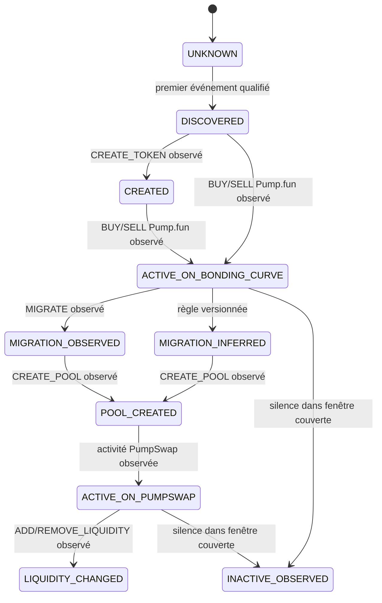

# RFC-006 — Token Lifecycle Engine

| Champ | Valeur |
| --- | --- |
| Numéro | RFC-006 |
| Titre | Token Lifecycle Engine |
| Statut | DRAFT |
| Auteur | Équipe AtlasPump |
| Date | 2026-07-16 |
| Version | 0.2 |

## Résumé

Le Token Lifecycle Engine reconstruit, pour un mint et une fenêtre d'observation, une histoire versionnée et traçable des faits observés. Il peut produire des inférences explicitement séparées, avec leur confiance et leur provenance. Un lifecycle est relatif à sa fenêtre : il peut être complet, partiel ou censuré, et ne prétend pas décrire nécessairement la vie réelle complète du token.

Cette RFC fixe le contrat fonctionnel entre `CanonicalEvent` et les futurs Quality Layer, Feature Lab et Dataset Factory. Elle ne fixe ni algorithme, ni seuil de confiance, ni politique détaillée de labels.

## Contexte et principes

Les événements canoniques concernés sont `CREATE_TOKEN`, `BUY`, `SELL`, `TRANSFER`, `MIGRATE`, `CREATE_POOL`, `ADD_LIQUIDITY`, `REMOVE_LIQUIDITY`, `UNKNOWN` et `INVALID_JSON`. Des expérimentations externes ont établi la faisabilité de regroupement par mint, tri, séquençage, détection de création/migration/activité PumpSwap, censure et sorties lifecycle/outcome/anomalies. Elles ne contraignent pas l'implémentation définitive.

Un lifecycle :

- est une vue reconstruite depuis les `CanonicalEvent` qualifiés et leurs manifests ;
- est calculé pour une fenêtre, une version de builder et un run donnés ;
- ne déduit jamais qu'un événement absent n'a jamais existé ;
- ne remplace jamais un fait observé par une inférence ;
- est recalculable quand `lifecycle_version` ou les entrées changent.

## Entités utilisées et sorties

RFC-003 reste propriétaire de `CanonicalEvent`, `Token`, `Wallet`, `Pool`, `TokenLifecycle`, `TokenOutcome`, `LifecycleAnomaly` et `Manifest`. Le moteur lit les événements normalisés et la qualité, et publie :

| Sortie | Clé logique | Contenu |
| --- | --- | --- |
| `token_lifecycles` | `mint + lifecycle_version + lifecycle_run_id` | Dimensions d'état, bornes d'observation, censure, couverture, contrat, utilisabilité et références de preuves. |
| `token_outcomes` | `mint + outcome_version + observation_end` | Faits et statistiques calculables depuis le passé disponible complet. |
| `lifecycle_anomalies` | `anomaly_id` | Anomalie, gravité, événements concernés, règle/version et résolution éventuelle. |
| Manifest | `manifest_id` | Entrées, hashes, fenêtre, versions, comptages, code et environnement. |

`TokenLifecycle` n'est pas la table d'événements : les événements restent dans `canonical_observations`. Les champs nécessaires sont `first_observed_timestamp`, `last_observed_timestamp`, `observation_duration_ms`, flags observés, flags inférés, `migration_confidence`, `activity_state`, `censoring_status`, `coverage_status`, `contract_status`, `usability_status` et références de manifeste.

## Fenêtres d'observation

| Concept | Définition |
| --- | --- |
| `observation_start`, `observation_end` | Bornes UTC de la fenêtre effectivement donnée au builder. |
| `first_observed_timestamp`, `last_observed_timestamp` | Bornes des événements qualifiés du mint dans cette fenêtre. |
| `observation_duration_ms` | Différence entre ces bornes ; `NULL` si l'une manque. |
| `observation_cutoff` | Instant maximal de connaissance autorisé pour une sortie donnée. |
| Fenêtre source | Intervalle couvert par les fichiers/flux en entrée. |
| Fenêtre de cohorte | Intervalle qui sélectionne les tokens étudiés, par exemple création observée. |
| Fenêtre de suivi | Intervalle post-cohorte autorisé pour mesurer états et outcomes. |
| Période de grâce | Intervalle explicitement documenté après une borne pour attendre retard de source ou finalisation. |

Cas obligatoires :

| Situation | Représentation |
| --- | --- |
| Création avant début de fenêtre | `censoring_status=LEFT`; aucune date de création non observée n'est inventée. |
| Création pendant fenêtre | `creation_event_received=true` si `CREATE_TOKEN` qualifié est observé. |
| Token actif à la fin | `censoring_status=RIGHT` sauf règle documentée prouvant une fin observée. |
| Inactif avant la fin | `INACTIVE_OBSERVED` seulement comme constat d'absence dans une période explicitement couverte ; pas comme disparition économique. |
| Migration après fenêtre | Non observée dans ce lifecycle ; censure droite si le suivi l'exige. |
| Activité PumpSwap sans création Pump.fun | `censoring_status=LEFT`, activité PumpSwap observée ; aucune origine inventée. |
| Création seule | `CREATED` et lifecycle partiel ; pas d'échec ni de succès déduit. |

## Machine d'états multidimensionnelle

Les états demandés ne sont pas une enum unique. Mélanger activité, migration, censure, complétude et qualité rendrait les combinaisons ambiguës. Le lifecycle contient les dimensions suivantes :

| Dimension | Valeurs proposées | Nature |
| --- | --- | --- |
| `activity_state` | `UNKNOWN`, `DISCOVERED`, `CREATED`, `ACTIVE_ON_BONDING_CURVE`, `POOL_CREATED`, `ACTIVE_ON_PUMPSWAP`, `LIQUIDITY_CHANGED`, `INACTIVE_OBSERVED` | État économique/observé principal, dérivé de faits. |
| `migration_state` | `NOT_OBSERVED`, `MIGRATION_OBSERVED`, `MIGRATION_INFERRED`, `AMBIGUOUS` | Fait ou inférence séparés ; confiance requise pour l'inféré. |
| `censoring_status` | `NONE`, `LEFT`, `RIGHT`, `BOTH` | Limite de fenêtre, non un état économique. |
| `coverage_status` | `COMPLETE`, `PARTIAL`, `MISSING` | Couverture effective de la source pour la fenêtre déclarée. |
| `contract_status` | `SATISFIED`, `NOT_SATISFIED`, `NOT_EVALUABLE` | Satisfaction du contrat de fenêtre/politique. |
| `usability_status` | `VALID`, `LIMITED`, `INVALID` | Utilisabilité selon la politique, sans confondre couverture et contrat. |

`UNKNOWN`, `LEFT`, `RIGHT`, `BOTH`, `COMPLETE`, `MISSING` et `INVALID` sont donc portés dans leur dimension appropriée. Les flags `pumpfun_activity_observed`, `pumpswap_activity_observed`, `pool_creation_received`, `liquidity_added`, `liquidity_removed`, `creation_event_received`, `migration_explicit` et `migration_inferred` préservent les faits ou les inférences individuels.

### Transitions autorisées

Un `TRANSFER`, `UNKNOWN` ou `INVALID_JSON` ne force pas une transition d'activité, mais peut découvrir un mint, modifier qualité ou générer une anomalie. Les transitions ne sont pas toutes monotones dans l'implémentation interne : un événement tardif peut réviser la reconstruction en publiant une nouvelle sortie versionnée, jamais en modifiant silencieusement une publication.

## Ordonnancement et règles de reconstruction

Les événements sont regroupés par `token_mint`, dédupliqués selon l'identité RFC-003, puis ordonnés par `blockchain_timestamp`, `slot`, `block_height`, `provider_block`, `source_position`, `transaction_index`, `instruction_index`, `event_index`, `signature`, `canonical_observation_id`. Les champs absents se trient après les valeurs connues à leur niveau ; `provider_block` et `source_position` ne prouvent pas un ordre chaîne. L'ordre de réception n'est pas substitué à l'ordre blockchain.

Le moteur produit un `sequence_index` déterministe par mint et run. Il consigne tout conflit d'ordre, duplicat divergent, référence de pool incohérente, adresse invalide, transition impossible ou donnée hors fenêtre dans `lifecycle_anomalies`. La politique de sévérité est versionnée et RFC-007 définira les critères qualité détaillés.

## Faits, inférences et preuves

| Élément | Fait observé | Inférence autorisée |
| --- | --- | --- |
| Création | `CREATE_TOKEN` qualifié. | Aucune création « certaine » sans fait. |
| Migration | `MIGRATE` qualifié. | `migration_inferred=true` si règle versionnée et preuves listées. |
| Pool | `CREATE_POOL` qualifié et identifiants observés. | Association de pool seulement avec confiance/provenance. |
| Activité protocol | Événements qualifiés dans le scope. | Aucun scope historique inventé depuis l'absence. |
| Inactivité | Absence dans une fenêtre source couverte et période de grâce écoulée. | Ne signifie ni mort économique ni fin de lifecycle réel. |

Toute inférence inclut au minimum `inference_rule_version`, `confidence`, références d'événements/manifeste et raison. Elle ne remplace pas le flag de fait associé.

## Censure, complétude et qualité

La censure est évaluée par rapport à la fenêtre source et à la fenêtre de suivi, pas par rapport à une supposition sur le token. `censoring_status=LEFT` indique que le début pertinent peut précéder la couverture ; `RIGHT` que le suivi requis peut dépasser la couverture ; `BOTH` cumule les deux. `contract_status=SATISFIED` exige une politique satisfaite, des fenêtres couvertes et une utilisabilité suffisante ; il n'implique jamais que la vie économique du token est terminée.

`coverage_status` décrit la couverture (`COMPLETE`, `PARTIAL`, `MISSING`) ; `contract_status` dit si le contrat est `SATISFIED`, `NOT_SATISFIED` ou `NOT_EVALUABLE` ; `usability_status` est `VALID`, `LIMITED` ou `INVALID`. `INVALID` indique des contradictions ou des entrées trop dégradées pour une reconstruction fiable. Les décisions de filtre pour features/datasets doivent utiliser ces dimensions et non un booléen de succès.

## Anomalies

| Classe | Exemple | Effet par défaut |
| --- | --- | --- |
| Ordre | événement tardif ou indices contradictoires | Publication révisée ou `usability_status=LIMITED`. |
| Identité | même identité d'observation avec contenu divergent | `usability_status=INVALID` / incident à investiguer. |
| Cohérence | pool/token ou scope contradictoires | Anomalie, pas correction silencieuse. |
| Couverture | heure source manquante | `coverage_status=PARTIAL` ou `MISSING`, censure selon contrat. |
| Transition | activité PumpSwap avant création observée | `censoring_status=LEFT`, éventuellement migration inférée. |
| Format | `UNKNOWN`/`INVALID_JSON` | Mesure, quarantaine ou qualité dégradée selon politique. |

## Versionnement, reprise et manifests

`lifecycle_version` versionne la sémantique du builder ; `lifecycle_run_id` identifie une exécution ; `quality_policy_version`, `schema_version` et `normalization_version` sont reportés depuis les entrées. Une nouvelle règle, fenêtre ou correction d'entrée crée une nouvelle publication, avec manifeste, hashes, comptages, cohortes, fenêtre, grace period, commit de code et empreinte d'environnement. Les runs doivent être idempotents : mêmes entrées/version/configuration produisent mêmes sorties et identités.

## Consommation par les RFC ultérieures

- RFC-007 utilise anomalies, couverture, censure et qualité comme métriques, sans changer les faits.
- Feature Lab ne calcule une feature que pour un `observation_cutoff` explicite et propage censure/qualité.
- Dataset Factory fixe des cohortes, fenêtres de suivi, politiques de filtre et versions de lifecycle dans ses manifests.
- TokenOutcome reste une sortie past-only : il ne crée pas de label ou prédiction implicite.

## Critères d'acceptation

La RFC pourra être `ACCEPTED` lorsque les dimensions d'état, transitions, fenêtres, censure, sorties, anomalies et versionnement sont validés comme cohérents avec RFC-003 ; les critères numériques et algorithmes resteront aux RFC spécialisées.

## Questions ouvertes

- Quelle durée et quelles conditions définissent la période de grâce par source ?
- Quelles règles et quels seuils autorisent une migration inférée ?
- Quelles transitions nécessitent `usability_status=VALID` plutôt que `LIMITED` ?
- Quand une inactivité observée doit-elle être publiée plutôt que laissée inconnue ?
- Quelle politique de révision appliquer aux événements tardifs après publication d'un pack ?
- Faut-il conserver plusieurs reconstructions concurrentes pour comparer des versions de builder ?

## Décision finale

En attente de revue. Cette RFC reste `DRAFT` et n'autorise aucune implémentation de brique structurante.

## Historique des modifications

| Date | Version | Modification | Auteur |
| --- | --- | --- | --- |
| 2026-07-16 | 0.1 | Création du brouillon | Équipe AtlasPump |
| 2026-07-17 | 0.2 | Harmonisation couverture/contrat/utilisabilité et ordre Solana avec RFC-003/RFC-007. | Équipe AtlasPump |
